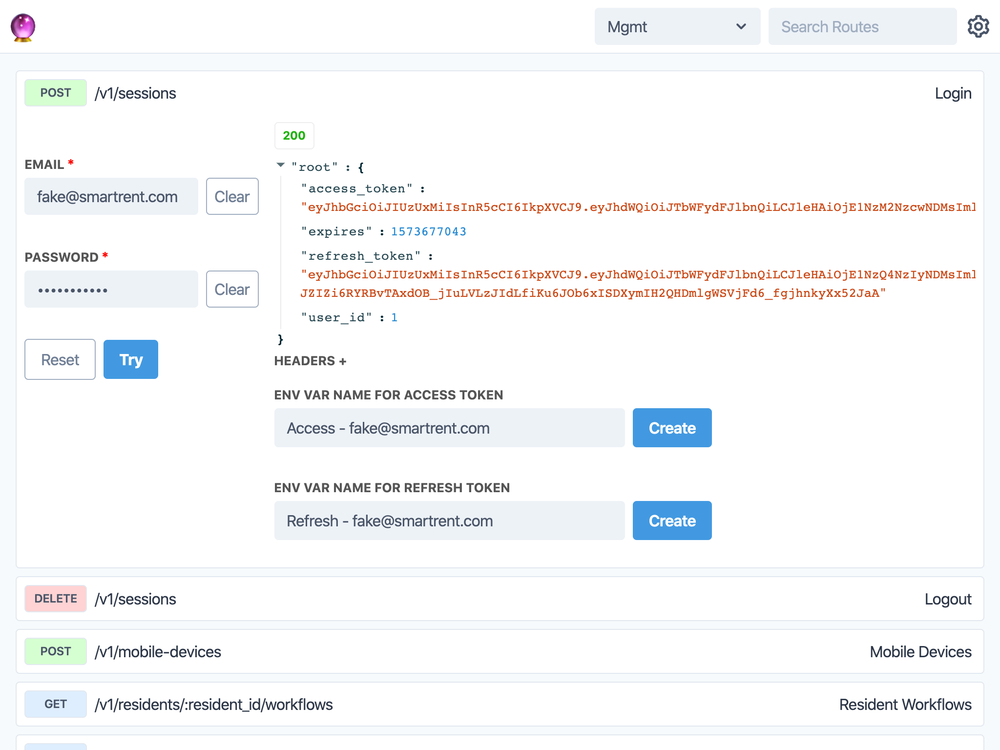

# 🔮 Bad Magic

Bad Magic is a Swagger-UI alternative that allows developers to visualize and test their API resources from a convenient web interface.



## Installation

```
yarn add badmagic
```

**You will also need to include the TailwindCSS stylesheet on the page you plan to use Bad Magic**

```html
<link
  href="https://unpkg.com/tailwindcss@^1.0/dist/tailwind.min.css"
  rel="stylesheet"
/>
```

## Badmagic Example

Clone `badmagic`, then run the following commands:

- `cd example`
- `yarn`
- `yarn start`

### Testing Locally

#### Terminal Window 1

In the `root badmagic directory` run the following commands:

- `yarn`
- `yarn link`
- `yarn start`

#### Terminal Window 2

In the `example directory` run the follow commands:

- `yarn` to install node modules in the example folder
- `yarn link "badmagic"`
- `yarn start` (to start the example that will be running on port 3000 by default)

## General Usage

```javascript
import { ContextProvider, Workspaces, Workspace, Theme } from "badmagic";
import { Method } from "badmagic/dist/types";

export default function BadMagic() {
  const superheroes = {
    id: "superheroes",
    name: "Superheroes",
    config: {
      baseUrl: `${window.location.origin}/api`,
    },
    plugins: [],

    routes: [
      {
        name: "Search Superheroes",
        path: "/v1/superheroes",
      },

      {
        name: "Fetch Superhero",
        path: "/v1/superheroes/:superhero_id",
      },

      {
        name: "Create Superhero",
        path: "/v1/superheroes",
        method: Method.POST,
        body: [
          { name: "first_name", required: true },
          { name: "last_name" },
          { name: "phone", placeholder: "Some digits to reach this superhero" },
          { name: "superpowers", type: "textarea" },
          {
            name: "age",
            options: [
              { label: "6", value: 6 },
              { label: "18", value: 18 },
              { label: "60", value: 60 },
            ],
          },
        ],
      },

      {
        name: "Update Superhero",
        path: "/v1/superheroes/:superhero_id",
        method: Method.PATCH,
        body: [
          { name: "first_name", required: true },
          { name: "last_name" },
          { name: "phone", placeholder: "Some digits to reach this superhero" },
          { name: "superpowers", type: "textarea" },
          {
            name: "age",
            options: [
              { label: "6", value: 6 },
              { label: "18", value: 18 },
              { label: "60", value: 60 },
            ],
          },
        ],
      },

      {
        name: "Delete Superhero",
        path: "/v1/superheroes/:superhero_id",
        method: Method.DELETE,
      },
    ],
  };

  return (
    <ContextProvider workspaces={[superheroes]}>
      <Theme>
        <Workspaces />
        <Workspace />
      </Theme>
    </ContextProvider>
  );
}
```

## Plugins

`badmagic` supports plugins at the workspace level or plugins specific to routes. If plugins are specified for a route, they will override all plugins at the workspace level.

### Sample Startup

Here is a sample `BearerAuth.tsx` plugin that will prompt the user to select a named access token from env vars that will then inject as an `Authorization` header with any routes that utilize this plugin:

```javascript
import React, { useState } from "react";
import { map, get, omitBy } from "lodash-es";

import { Button, Select, Success, Params } from "badmagic";
import { ParamType } from "badmagic/dist/types";

export default function BearerAuthorization({
  context,
  route,
  reFetch,
  loading,
}) {
  const { environment, routeConfig, setHeader } = context;
  if (!(route && route.name)) {
    return null;
  }
  const routeConfigVars = routeConfig[route.name];
  const bearerAuth = get(routeConfigVars, "headers.Authorization");
  const [success, setSuccess] = useState("");
  const envVars = omitBy(environment, (value, key) => !key.includes("Access"));

  return (
    <div>
      <Params paramType={ParamType.urlParams} reFetch={reFetch} route={route} />
      <Params paramType={ParamType.body} reFetch={reFetch} route={route} />
      <Params paramType={ParamType.qsParams} reFetch={reFetch} route={route} />
      <Select
        value={bearerAuth ? bearerAuth.replace("Bearer ", "") : ""}
        style={{ marginRight: "4px" }}
        onKeyDown={(e) => {
          if (e.key === "Enter") {
            reFetch();
          }
        }}
        onChange={(e) => {
          if (e.currentTarget.value) {
            setHeader({
              route,
              key: "Authorization",
              value: `Bearer ${e.currentTarget.value}`,
            });
            setSuccess("Authorization header set");
          } else {
            setHeader({
              route,
              key: "Authorization",
              value: "",
            });
            setSuccess("");
          }
        }}
      >
        <option value="">Select Authorization</option>
        {map(envVars, (value, key) => (
          <option key={key} value={value}>
            {key.replace("Access - ", "")}
          </option>
        ))}
      </Select>
      <Success>{success}</Success>
      <Button disabled={loading} onClick={reFetch}>
        {loading ? "Loading..." : "Try"}
      </Button>
    </div>
  );
}
```

Usage:

```javascript
const superheroes = {
    id: "superheroes",
    name: "Superheroes",
    config: {
      baseUrl: `${window.location.origin}/api`,
    },
    plugins: [
    {
      Component: BearerAuthorization,
      inject: Inject.asRequest,
    },
  ],,

    routes: [
      {
        name: "Search Superheroes",
        path: "/v1/superheroes",
      },

      {
        name: "Fetch Superhero",
        path: "/v1/superheroes/:superhero_id",
      },

      {
        name: "Create Superhero",
        path: "/v1/superheroes",
        method: Method.POST,
        body: [
          { name: "first_name", required: true },
          { name: "last_name" },
          { name: "phone", placeholder: "Some digits to reach this superhero" },
          { name: "superpowers", type: "textarea" },
          {
            name: "age",
            options: [
              { label: "6", value: 6 },
              { label: "18", value: 18 },
              { label: "60", value: 60 },
            ],
          },
        ],
      },

      {
        name: "Update Superhero",
        path: "/v1/superheroes/:superhero_id",
        method: Method.PATCH,
        body: [
          { name: "first_name", required: true },
          { name: "last_name" },
          { name: "phone", placeholder: "Some digits to reach this superhero" },
          { name: "superpowers", type: "textarea" },
          {
            name: "age",
            options: [
              { label: "6", value: 6 },
              { label: "18", value: 18 },
              { label: "60", value: 60 },
            ],
          },
        ],
      },

      {
        name: "Delete Superhero",
        path: "/v1/superheroes/:superhero_id",
        method: Method.DELETE,
      },
    ],
  };
```

## Route Documentation

- Each route can specify documentation by adding a `documentation` key to the object.
- `documentation` accepts a string literal template that will render into markdown
- Styling
  - Your own styles can be applied to the markdown by prefixing the styles with `.badmagic-markdown`
  - Alternatively, you can import BadMagic's stylesheet for default styling:
    ```html
    <link
      href="https://unpkg.com/badmagic@^0.0.16/dist/css/markdown.min.css"
      rel="stylesheet"
    />
    ```

Usage:

```javascript
const superheroes = {
  id: "superheroes",
  name: "Superheroes",
  config: {
    baseUrl: `${window.location.origin}/api`,
  },
  plugins: [
    {
      Component: BearerAuthorization,
      inject: Inject.asRequest,
    },
  ],
  routes: [
    {
      name: "Search Superheroes",
      path: "/v1/superheroes",
      documentation: `
      # Fetches list of all super heros
      ## Reponse
      \`\`\`json
      [
        {
          "name": "Spiderman",
          "age": "29",
          "location": "Forest Hills"
        }
      ]
      \`\`\`
      `,
    },
    {
      name: "Fetch Superhero",
      path: "/v1/superheroes/:superhero_id",
    },
  ],
};
```

## Questions

> Why did you name this `badmagic`?

Right before a production deploy, I was contemplating an easy to implement API interface that can be consumed by engineers during local testing and by QA teams during the QA phase of the SDLC and is pluggable. As the deploy was kicked off, my Macbook crashed and when I rebooted, my crash report said "Bad magic! Kernel panic!" and in that moment, the package name had been decided.

## Local Testing

The below assumes you have `wml` installed:

- `yarn` to get dependencies for `badmagic`
- In one terminal window with `badmagic` in the CWD run `wml add . ../path/to/your/project/node_modules`
- Then in that same window run `wml start`
- In a second terminal window with `badmagic` in the CWD run `yarn start`
- Restart the frontend of your project. Now anytime you save a file in this project it will get applied to your other project that had `badmagic` installed
